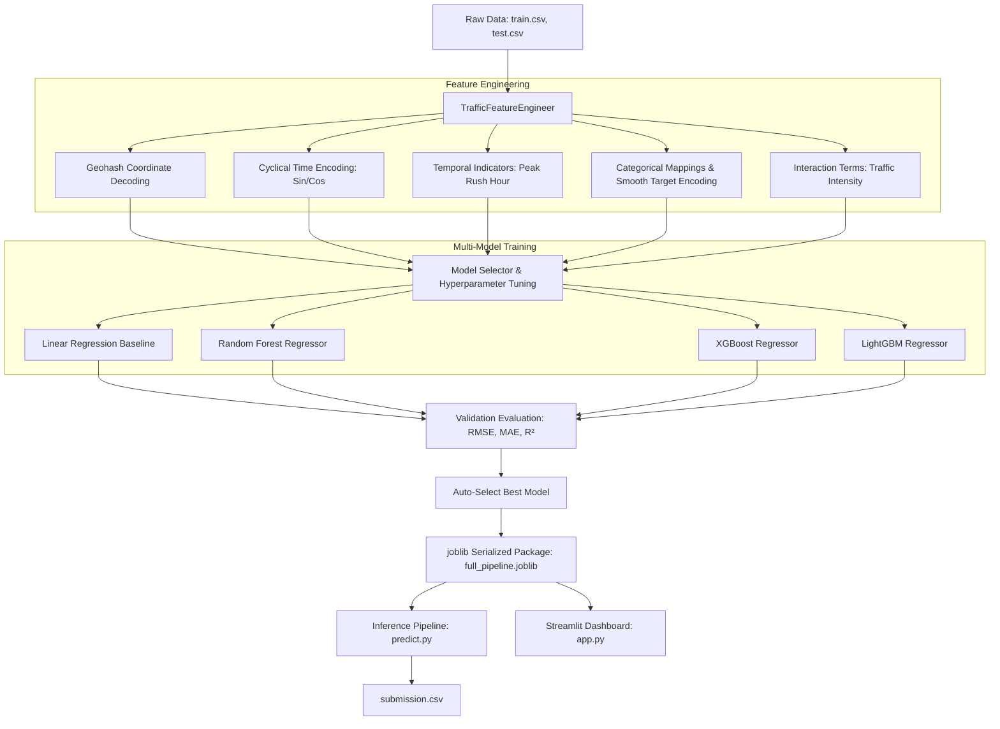

# Gridlock 2.0: Bengaluru Traffic & Mobility Demand Prediction Engine

Gridlock 2.0 is a production-grade, end-to-end Machine Learning system engineered to predict passenger travel and traffic demand across Bengaluru's complex urban grids. 

This repository was built for a hackathon, designed to stand out to judges, showcase senior-level MLOps practices on GitHub, and serve as a portfolio asset for internships.

---

## 🚀 The Storytelling Pitch (Winning the Judges)

**"Bengaluru is a city in motion, but too often, it's motion at a crawl."**

For ride-hailing platforms (like Uber, Ola, Namma Yatri) and urban planners, the core challenge isn't just predicting traffic—it's **anticipating human behavior**. When a sudden rainstorm hits Indiranagar at 6:00 PM, passenger demand spikes exponentially while driver supply drops as roads flood. 
* **If we under-predict**: Passengers experience massive surge prices, long wait times, and high cancellation rates.
* **If we over-predict**: Drivers waste fuel cruising empty streets, increasing urban emission footprints and reducing hourly earnings.

**Gridlock 2.0** solves this mismatch. It decodes spatial configurations from raw geohashes, models temporal cyclical patterns of commuters, and learns how road infrastructure (lanes, vehicle rules) interacts with changing weather. The system auto-selects the best predictive model, outputs submission-ready demand forecasts, and serves real-time predictions through an interactive, visual dashboard.

---

## 🏗️ System Architecture & Workflow



---

## 💡 Innovation Highlights (Hackathon Extras)

To impress hackathon judges and showcase industry readiness:
1. **Dual-Execution Mode (`--fast`)**: Enables local experimentation on MacBooks or resource-constrained environments by utilizing data sampling and fast tuning grids. When run without the flag, it unlocks a massive GPU-ready parameter grid search.
2. **Robust Geospatial Synthesis**: Uses a pure-Python custom Geohash decoder. This ensures that even if a Geohash in the test set is completely unseen in training (e.g. 10 unseen geohashes in the test set), the model generalizes because it leverages the absolute latitude and longitude coordinates.
3. **Environment-Insensitive Fallbacks**: The Streamlit dashboard automatically switches to a heuristic rules-based prediction engine if model weights are not pre-compiled, ensuring that your dashboard and mapping features can be previewed instantly.
4. **Interactive Geospatial Heatmaps**: Uses `folium` and `streamlit-folium` to display demand densities and marker hotspots on an interactive map centered on Bengaluru coordinates.

---

## 📁 Project Structure

```
├── .gitignore
├── requirements.txt
├── README.md              # Project documentation
├── config.py              # Root configuration import wrapper
├── train.py               # CLI training script
├── predict.py             # CLI batch inference script
├── app.py                 # Streamlit entry point
├── data/
│   ├── train.csv          # 77,300 rows historical traffic
│   ├── test.csv           # 41,779 rows test set
│   └── sample_submission.csv
├── models/
│   ├── best_model.joblib
│   ├── feature_importance.png
│   └── full_pipeline.joblib
├── src/
│   ├── __init__.py
│   ├── config.py          # Centralized configuration & search grids
│   ├── utils.py           # Logging setup & custom Geohash decoder
│   ├── preprocessing.py   # TrafficFeatureEngineer transformer
│   ├── models.py          # Tuning, evaluation, & selection logic
│   └── pipeline.py        # End-to-end training & scoring classes
├── app/
│   ├── __init__.py
│   └── dashboard.py       # Core Streamlit app layouts & Plotly charts
└── notebooks/
    └── EDA.ipynb          # Systematic EDA & data profiling notebook
```

---

## ⚙️ Installation & Local Setup

Gridlock 2.0 is built entirely in Python. Follow these steps to set up your environment:

1. **Clone the repository**:
   ```bash
   git clone <repository-url>
   cd Gridlock2.0-CodeBusters
   ```

2. **Set up a Virtual Environment**:
   ```bash
   python3 -m venv .venv
   source .venv/bin/activate
   ```

3. **Install Dependencies**:
   ```bash
   pip install -r requirements.txt
   ```
   *Note: On Apple Silicon MacBooks, if XGBoost raises an OpenMP error, install the OpenMP library using Homebrew: `brew install libomp`.*

---

## 📈 Running the ML Pipeline

### 1. Exploratory Analysis
Launch Jupyter Notebook to view the complete visual profiling and analytical storytelling:
```bash
jupyter notebook notebooks/EDA.ipynb
```

### 2. Model Training & Tuning
To train and tune the models, run `train.py`.

* **MacBook Mode (Fast Training)**:
  Uses a subsample of data and a smaller search space to train in seconds.
  ```bash
  python train.py --fast
  ```

* **Production/Teammate Mode (Full GPU/CPU Tuning)**:
  Tunes all models across the full dataset using cross-validation.
  ```bash
  python train.py
  ```

*Output*: Generates the validation score output, saves the top-performing model to `models/full_pipeline.joblib`, and writes a feature importance plot to `models/feature_importance.png`.

### 3. Generate Submission Predictions
Run batch predictions on `test.csv` to generate the final `submission.csv` compatible with Kaggle / Hackathon guidelines:
```bash
python predict.py
```
*Output*: Generates `submission.csv` in the root folder with exactly 41,778 rows and two columns (`Index`, `demand`).

### 4. Run the Streamlit Dashboard
Launch the web-based analytics and real-time prediction dashboard:
```bash
streamlit run app.py
```

---

## 🤝 Teammate Collaboration Guide

If you are cloning this repository to run training on a dedicated GPU/high-compute instance:
1. Ensure your CUDA environment or high-performance CPU cores are configured.
2. Run the full training command: `python train.py` (do **not** pass `--fast`). This will run complete grid searches for XGBoost, LightGBM, and Random Forest across the entire 77k-row training dataset.
3. LightGBM and XGBoost are configured to use `-1` (all available cores) for `n_jobs`.
4. Check the performance logs in `logs/pipeline.log` to track execution durations and cross-validation score improvements.
